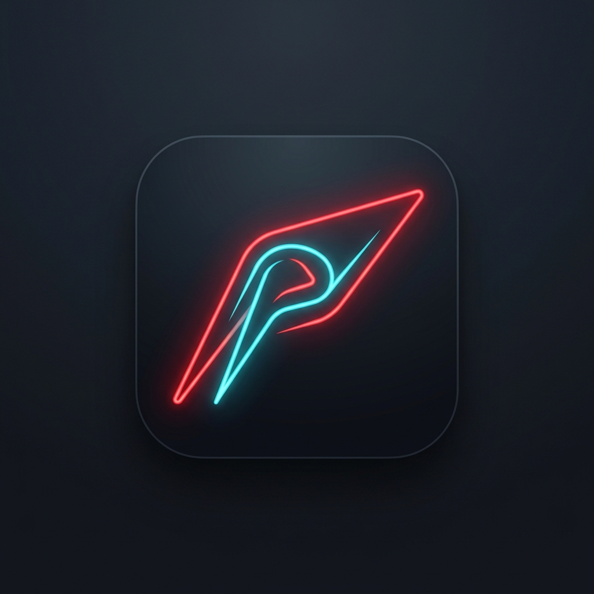

# 🏁 Paddock Analytics

A premium, modern, and responsive Formula 1 telemetry and statistics dashboard. Browse historical archives, track standings, view race schedules, and explore results with team branding.



## ✨ Features

*   **🏆 Standings:** Real-time and historical Driver and Constructor Championship standings.
*   **📅 Schedules & Results:** Detailed calendar of Grand Prix weekends, including practice sessions, qualifying, sprint shootouts, and race results.
*   **📜 Historical Archive:** Dive deep into past Formula 1 seasons, constructors, and champions from 1950 onwards.
*   **🎨 Dynamic Brand Aesthetics:** Custom-mapped, high-quality team logos (SVGs/PNGs) and team colors for all active and major historical constructors (e.g. Brawn GP, BMW Sauber, Force India, Caterham, Minardi).
*   **📱 Responsive Design:** Sleek, glassmorphic layout optimized for both desktop views and mobile navigation (via collapsible navigation menu).

## 🛠️ Tech Stack

*   **Framework:** [Next.js](https://nextjs.org/) (App Router & Turbopack)
*   **Library:** [React](https://react.dev/)
*   **Styling:** Vanilla CSS (Custom layout variables)
*   **Data Source:** Ergast API & OpenF1 API

## 🚀 Getting Started

### 1. Run the Development Server

Clone the repository, install dependencies, and run the development server locally:

```bash
npm install
npm run dev
```

Open [http://localhost:3000](http://localhost:3000) in your browser to see the application in action.

### 2. Build for Production

To create an optimized production build:

```bash
npm run build
npm start
```

## 🌐 Deployment (Vercel)

This application is ready to deploy to the [Vercel Platform](https://vercel.com/new).

1. Push your code to a GitHub, GitLab, or Bitbucket repository.
2. Log in to Vercel and import your repository.
3. Vercel automatically detects Next.js configurations and sets up continuous deployment on every push.
